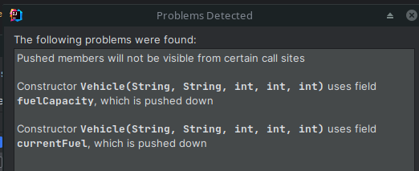

# Exercise 8: push members down/create subclass

In this example we have a Superclass called Vehicle which was originally introduced to share behavior between Car and Truck.
We would like to introduce a new Vehicle Type called bike now but notice that Vehicle currently has some members which do not make sense for a bike.
To work around this we can push these members down to the subclasses before introducing the new subclass.

1. Push down the "fuelCapacity" and "currentFuel" fields and the "refuel" method. 
   1. Right-click somewhere inside the class' body(not inside a method) -> refactor -> push members down (or ctrl+shift+a...)
   2. Select the above members; notice that intellij highlights the members that depend on each-other in red.
   Also notice that we overlooked something; the "accelerate()" method currently uses fuel!
   3. Since a bike can accelerate as well we would like to retain this method for the bike class, 
   but it will need a different implementation when we create that subclass
   => check the "keep abstract" box for this method and press refactor
   4. You will get below warning   
   
   5. For now ignore it and pressed the "continue" button. 
   6. You will see that the field assignment is still happening in the constructor. 
   This is a limitation of intellij. To alleviate this, manually copy the field assignments to the Car
   and Truck subclasses' constructors and remove the unused field from the Vehicle class' constructor 
2. Now create the new bike subclass, you can do this by pressing alt-enter on the Vehicle classname and selecting "Create Subclass" (or ctrl+shift+a ...)
   1. The implementation is less important for this exercise but notice how Intellij automatically created a constructor matching the superclass and a stub for the accelerate method